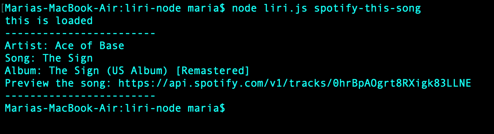

# LIRI - Node Application
LIRI is a *language interpretation and recognition interface* which executes on the command line as a node application. LIRI accepts the parameters, *concert-this*, *spotify-this-song*, *movie-this*, or *do-what-it-says* along with the search term you would like to query. In return, LIRI provides the appropriate data back to the user. Details on how to use LIRI are provided below.

## Instructions 

### concert-this 

To recieve information about a musicians next concert, enter the parameters *concert-this* followed by the artist's name on the command line, as shown in the image below. LIRI will provide information about the next 5 concert venues, locations, and dates. 

If you don't enter the artist's name after *concert-this*, LIRI will provide the concert information for Muse. 

### spotify-this-song

To recieve information about a song, enter the parameters *spotify-this-song* followed by the name of the song on the command line, as shown below. LIRI will provide information about the artist, song name, album, and a link to preview the song on spotify.

If you don't enter the artist's name after the parameter *spotify-this-song*, LIRI will provide information about "The Sign" by Ace of Base.

### movie-this

To retrieve information about a movie, enter the parameters *movie-this* followed by the movie title on the command line, as shown below. LIRI will provide the movie's title, release year, IMDB rating, Rotten Tomatoes rating, country of origin, language, plot, and actors. 

If you don't enter the movie title after the parameter *movie-this*, LIRI will provide information about the movie, Mr. Nobody.

### do-what-it-says

Enter *do-what-it-says* on the command line, as shown below, to retrieve information about the song "I Want It That Way" by The Backstreet Boys. 

### wrong parameter
If you enter the wrong parameters on the command line, LIRI will prompt you with the following error message. You must re-enter entire argument into the command line. 

